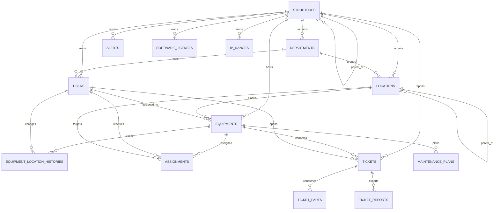

# EPSP Bachir Mentouri - Schema de base

## Vue d'ensemble

Le projet couvre maintenant les domaines centraux du cahier des charges:

- organisation EPSP avec hierarchie de structures
- gestion des services et locaux
- gestion des equipements et de leur localisation
- affectations et historique
- tickets, maintenance, alertes et licences
- utilisateurs multi-roles via Spatie Permission

## Tables principales

| Domaine | Tables |
|---|---|
| Organisation | `structures`, `departments`, `locations` |
| Utilisateurs | `users`, `roles`, `permissions`, `model_has_roles`, `model_has_permissions` |
| Parc informatique | `equipment_types`, `equipment_type_translations`, `equipment_categories`, `equipment_category_translations`, `equipments`, `equipment_translations`, `equipment_photos`, `equipment_location_histories` |
| Affectation | `assignments` |
| Maintenance | `tickets`, `ticket_parts`, `ticket_reports`, `intervenants`, `maintenance_plans`, `alerts`, `audit_logs` |
| Reseau | `ip_ranges`, `ip_addresses`, `vlans`, `switch_devices`, `switch_ports` |
| Licences | `software_licenses`, `license_installations` |
| IA / aide | `ai_requests`, `ai_insights` |

## Relations logiques

## Migrations principales ajoutees ou renforcees

1. `2026_03_25_090000_add_epsp_hierarchy_and_locations.php`
2. `2026_02_12_090001_create_structures_departments_suppliers_tables.php`
3. `2026_02_12_090002_create_equipment_core_tables.php`
4. `2026_02_12_090003_create_assignments_table.php`
5. `2026_02_12_090004_create_tickets_tables.php`
6. `2026_02_12_090007_create_audit_alerts_maintenance_ai_tables.php`
7. `2026_02_12_090008_create_permission_tables.php`

## Notes d'alignement avec le besoin

- `structures.parent_id` permet la hierarchie `structure -> sous-structure`.
- `locations` couvre les bureaux, salles, secretariats et locaux medicaux.
- `equipments.location_id` et `assignments.location_id` ajoutent une localisation exploitable et relationnelle.
- `StructuresSeeder` et `LocationsSeeder` posent une base EPSP coherente avec le siege, les directions et les structures externes.
